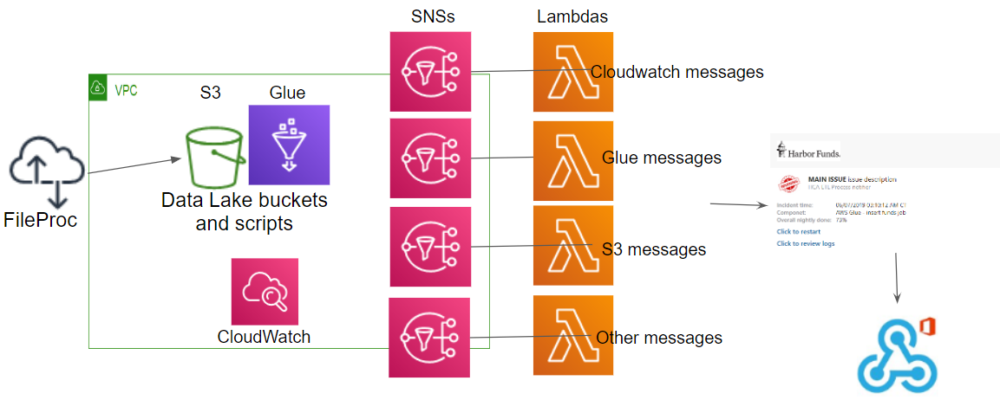

# Alerting planning 

## Description 

The alerting mechanim is a combination of SNS that will get the alerts and send them to the right Lambda.
The Lambda will create the right Microsoft Teams card and send it to all Microsoft Teams channel that are subscribed.
Each Lambda will handle a specific message format (will be probably be different for each alert sender)
There will be only one instance of the code and it will be deployed multiple times (mulitple lambdas), each lambda will load the relevant card formatter.

## Lambda code modules

__**lambda_function.py**__

This is the main class when the Lambda is called it will start with the "send_notification" method, this will load the relevant card to handle based on the "CARD_BUILDER" environment variable.
Then it will create the card using the relevant moudle and load all URL from the environment variables using the EnvUrlLoader method in the env_url_loader module and finally sends it.

__**env_url_loader.py**__

Load all subscribing URLs by the prefix (ENV_VARIABLE_PREFIX)

__**teams_sender.py**__

This module gets the URLs and the card_formatter module and sends to all subscribed URLs 

__**cloudwatch_card_formatter.py**__

This module creates Microsoft Teams cards out of AWS CloudWatch alerts, it has two cards option, one for new alerts and another card for cleared alerts
 
 When using the Lambda with the CloudWatch formatter, there will be another environment variables called "CARD_LOG" which will refer to the relevant CloudWatch page.
 
 

  

