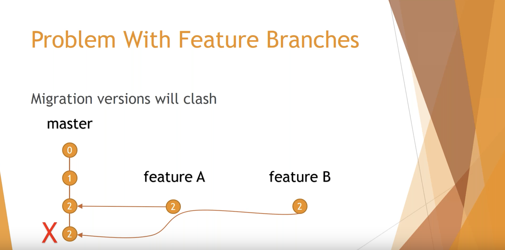
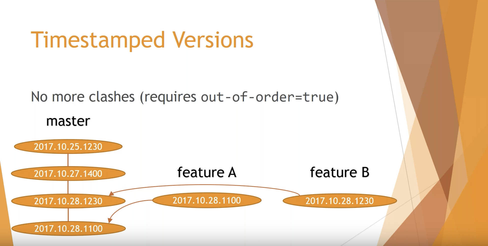

# Data Mart

Construction of HCA data mart database.

This includes

- Database schema and schema migrations
- One-time data loading

# Migrate DB with Flyway
## PostgreSQL
PostgreSQL is our database for production. For local developement, you need to install a PostgreSQL instance or launch docker instance using [docker-compose.yml](../../docker-compose.yml). This docker-compose already contains flyway image. Starting this container automatically runs flyway migration. Once container is up and running, additional migration should be executed manually. 

This document assumes it is running on 5432 port. If you use a different port, then jdbc url should have the port number.

## Flyway
Flyway is a database migration tool. It scans SQL files, execute them to modify a database, and keeps records using `flyway_schema_history` table. For more information, read Flyway's documentaion pages([Getting Started](https://flywaydb.org/getstarted) or [Documentation](https://flywaydb.org/documentation)) and watch [How to do Database Migration with Flyway?](https://www.youtube.com/watch?v=NDlZ6fP4X7s)

## Install Flyway
[Installing Flyway](https://flywaydb.org/documentation/commandline/#download-and-installation) is simple. Download the zipped file for your OS, unzip it to any folder, add the folder to local machine's PATH.

## SQL Files
To modify a database, create files under `PROJECT_ROOT/data-lake/databases/datamart/04-post-init`. Flyway will scan this folder and run files ascending order of filename. File names should be following format: `V[VERSON]__[DESCRIPTION].sql`.  

`[VERSION]` could be X, X.Y, X.Y.Z, X_Y, X_Y_Z, or timestamp like 2020_03_30_1130. In order to reduce the probability of the same version number for two different developers, timestamp approach will be used.  





For example, to add a Person table to ods schema, we can create a file `V2020_03_30_1400__Create_person_table.sql` and add the following DDL:

```
CREATE TABLE ods.Person (
    id int not null,
    name varchar(100) not null
);

```

## Migrate
Flyway's `migrate` command executes SQL files. `migrate` can be executed by following CLI command:

```
$ flyway migrate \
-url=jdbc:postgresql://HOST_NAME/DATABASE_NAME \
-user=DB_USERNAME \
-password=DB_PASSWORD \
-schemas=SCHEMA_NAME1,SCHEMA_NAME2
-locations=filesystem:PATH-TO-SQL
```

### Local Development Environment
If flyway is executed at the PROJECT_ROOT folder, then the above command will be replaced with following command:

```
$ flyway migrate \
-url=jdbc:postgresql://localhost/hca_dev \
-user=hca_dev \
-password=hca_dev \
-schemas=hdm,ods,mart
-locations=filesystem:./data-mart/databases/datamart
```

If this migrate is successful, then you will see messages like:
```
Flyway Community Edition 6.3.1 by Redgate
Database: jdbc:postgresql://localhost/hca_dev (PostgreSQL 11.7)
Successfully validated 2 migrations (execution time 00:00.020s)
Current version of schema "hdm": 1
Migrating schema "hdm" to version 2020.03.30.1400 - Create person table
Successfully applied 1 migration to schema "hdm" (execution time 00:00.054s)
```

#### Configuration File
Instead of passing options to Flyway CLI, we can use a configuration file. `data-mart/databases/datamart/dev.conf` has the same options above. It is a list of key/value pairs and each key has `flyway.` prefix. 

```
flyway.url=jdbc:postgresql://localhost/hca_dev
flyway.user=hca_dev
flyway.password=hca_dev
flyway.locations=filesystem:./data-mart/databases/datamart
flyway.schemas=hdm,ods
```

Using this `dev.conf` file, the above command can be executed like following:
```
$ flyway migrate -configFiles=./data-mart/databases/datamart/dev.conf
```

### QA and Production Environment
Migrating a database consists of 4 parts; `init-tables-views`, `init-dms`, `init-constraints`, and `post-init`.  

- `init-tables-views` will create tables and views via `Flyway`

- `init-dms` loads data into database via `AWS DMS`

- `init-constratins` adds constraints such as adding keys and indicies via `Flyway`

- `post-init` adds tables and columns created while development via `Flyway`

Once database initialization is done, we now add additional tables and columns added while developing. Let's call this job `post-init`.

On local development environment, all 4 jobs can be executed as one step vi Flyway. But in QA and Prodcution, each step should be executed separately.

Flyway CLI option has higher precedence over values in configuration files. Thus passing `-locations=filesystem:./data-mart/databases/datamart/01-init-tables-views` will override locations value, `filesystem:./data-mart/databases/datamart`, in the configuration file. By specifying locations on Flyway CLI, you can run specific SQL files only if they are the first SQL statements to be executed.

In QA and Production, if you want to run SQL files in the first step, `init-tables-views`, only, then run the following command:

```
$ flyway migrate \
-configFiles=./data-mart/databases/datamart/dev.conf \
-locations=filesystem:./data-mart/databases/datamart/01-init-tables-views
```

Once AWS DMS is executed (`init-dms` step, which doesn't have any SQL files for Flyway), rest of SQL files can be executed. Flyway doesn't allow run new SQL files without executing previous SQL files. So, from now on you can run the following simpler command 
```
$ flyway migrate -configFiles=./data-mart/databases/datamart/dev.conf
```

## Multiple Databases
At the time of wiring this README file, there is one database. All SQL files are placed under `data-mart/databases/datamart/`. On adding a new database, we create a subfolder under `data-mart/databases`. For example, a new database `new-db` is added, then create a subfolder `data-mart/databases/new-db`, create a configuration file with corresponding values.

Also Flyway migration should be executed for each database.

## Github Actions
When there is a push to github or PR is crated, Github action for flyway will be triggered. For Github Actions, please see the following videos:
- [GitHub Actions - Now with built-in CI/CD! Live from GitHub HQ](https://www.youtube.com/watch?v=E1OunoCyuhY)
- [Advanced GitHub Actions: workflows for production grade CI/CD - GitHub Universe 2019](https://www.youtube.com/watch?v=0ahRkhrOePo)

We created a job for flyway, "Migration Test". This will run all SQL files under `data-mart/databases/datamart` folder by spining up a PostgreSQL docker instance.

## Troubleshooting

>ERROR: Found non-empty schema(s) "ABC" but no schema history table. Use baseline() or set baselineOnMigrate to true to initialize the schema history table.

`migrate` operation cannot be run because `flyway_schema_history` table is not created. In order to create the table, run `flyway baseline` command for each schema

```
$ flyway baseline \
-url=jdbc:postgresql://HOST_NAME/DATABASE_NAME \
-user=DB_USERNAME \
-password=DB_PASSWORD \
-schemas=SCHEMA_NAME
```